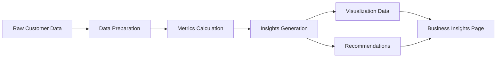

# Business Metrics Module - Implementation Plan

## Project Overview

Develop a comprehensive business metrics module that calculates key performance indicators with clear, actionable business insights. This MVP focuses on core metrics that work with existing data while maintaining flexibility for future enhancements.

---

## Architecture Design

### Module Structure

```
src/
├── biz_metrics.py (existing - will be enhanced)
├── metrics/
│   ├── __init__.py
│   ├── churn_metrics.py      # Churn rate calculations
│   ├── retention_metrics.py  # Retention and cohort analysis
│   ├── clv_metrics.py        # Customer Lifetime Value
│   ├── revenue_metrics.py    # Revenue trends and growth
│   ├── roi_metrics.py        # ROI calculations
│   ├── growth_metrics.py     # Business growth indicators
│   └── insights.py           # Insights generator
└── helpers.py (existing - will be extended)
```

### Data Flow



---

## Metric Specifications

### 1. Churn Rate Metrics

**Purpose**: Measure customer attrition and identify at-risk segments

**Calculations**:
- **Overall Churn Rate**: `churned_customers / total_customers * 100`
- **Segment Churn Rate**: Churn rate by customer segment, region, payment type, tenure bucket
- **Churn Trend**: Month-over-month or period-over-period comparison (if temporal data available)

**Inputs**:
- DataFrame with [`churn`](data/sample_churn.csv:1) column (0=retained, 1=churned)
- Optional: segment columns, time period column

**Outputs**:
```python
{
    'overall_churn_rate': 15.2,
    'total_customers': 1000,
    'churned_customers': 152,
    'retained_customers': 848,
    'by_segment': {
        'High Value': {'churn_rate': 8.5, 'count': 200},
        'Medium Value': {'churn_rate': 12.3, 'count': 500},
        'Low Value': {'churn_rate': 22.1, 'count': 300}
    },
    'by_region': {...},
    'insights': [
        'Overall churn rate is 15.2%, which is moderate',
        'Low Value segment has highest churn at 22.1%',
        'Focus retention efforts on Low Value customers'
    ]
}
```

---

### 2. Retention Rate Metrics

**Purpose**: Measure customer loyalty and lifetime patterns

**Calculations**:
- **Overall Retention Rate**: `retained_customers / total_customers * 100`
- **Cohort Retention**: Retention by signup cohort (if tenure data available)
- **Segment Retention**: Retention by customer value, region, etc.
- **Retention by Tenure**: Analyze retention patterns across customer lifecycle

**Inputs**:
- DataFrame with [`churn`](data/sample_churn.csv:1), [`tenure_months`](data/sample_churn.csv:1), segment columns

**Outputs**:
```python
{
    'overall_retention_rate': 84.8,
    'by_tenure_bucket': {
        '0-6 months': {'retention_rate': 75.0, 'count': 150},
        '7-12 months': {'retention_rate': 82.5, 'count': 200},
        '1-2 years': {'retention_rate': 88.0, 'count': 300},
        '2-3 years': {'retention_rate': 92.0, 'count': 250},
        '3+ years': {'retention_rate': 95.0, 'count': 100}
    },
    'by_segment': {...},
    'cohort_analysis': {
        'cohort_0_6_months': [100, 85, 78, 72, 68],  # retention over time
        'cohort_7_12_months': [100, 88, 82, 78, 75]
    },
    'insights': [
        'Retention improves significantly after 12 months',
        'First 6 months are critical - 25% churn rate',
        'Focus onboarding improvements for new customers'
    ]
}
```

---

### 3. Customer Lifetime Value (CLV)

**Purpose**: Estimate the total value a customer brings over their lifetime

**Calculations**:

**Simple CLV**:
```
CLV = avg_order_value × avg_orders_per_period × avg_customer_lifespan × profit_margin
```

**Predictive CLV** (with discount rate):
```
CLV = Σ(profit_per_period × retention_rate^t) / (1 + discount_rate)^t
```

**Inputs**:
- [`avg_order_value`](data/sample_churn.csv:1), [`total_orders`](data/sample_churn.csv:1), [`tenure_months`](data/sample_churn.csv:1)
- Optional: profit_margin (default 30%), discount_rate (default 10%)

**Outputs**:
```python
{
    'simple_clv': {
        'overall_clv': 450.00,
        'by_segment': {
            'High Value': 1200.00,
            'Medium Value': 600.00,
            'Low Value': 180.00
        }
    },
    'predictive_clv': {
        'overall_clv': 385.50,
        'by_segment': {...}
    },
    'clv_to_cac_ratio': 3.5,  # if CAC data available
    'insights': [
        'Average customer lifetime value is $450',
        'High Value customers worth 6.7x more than Low Value',
        'CLV/CAC ratio of 3.5:1 indicates healthy unit economics'
    ]
}
```

---

### 4. Revenue Trend Analysis

**Purpose**: Track revenue patterns and growth

**Calculations**:
- **Total Revenue**: Sum of all customer order values
- **Revenue by Segment**: Revenue contribution by customer groups
- **Average Revenue Per Customer (ARPC)**: `total_revenue / total_customers`
- **Revenue Growth Rate**: Period-over-period growth (if temporal data available)

**Inputs**:
- DataFrame with [`avg_order_value`](data/sample_churn.csv:1), [`total_orders`](data/sample_churn.csv:1)
- Optional: time period column for trend analysis

**Outputs**:
```python
{
    'total_revenue': 500000.00,
    'arpc': 500.00,
    'revenue_by_segment': {
        'High Value': {'revenue': 240000, 'percentage': 48.0},
        'Medium Value': {'revenue': 180000, 'percentage': 36.0},
        'Low Value': {'revenue': 80000, 'percentage': 16.0}
    },
    'revenue_at_risk': 75000.00,  # from churned customers
    'potential_revenue_loss': 225000.00,  # future value at risk
    'insights': [
        'Total revenue is $500K with $500 per customer',
        'High Value segment drives 48% of revenue',
        '$75K revenue at risk from current churn'
    ]
}
```

---

### 5. ROI Metrics

**Purpose**: Calculate return on investment for retention initiatives

**Calculations**:
- **Retention Campaign ROI**: `(revenue_saved - campaign_cost) / campaign_cost * 100`
- **Cost per Retained Customer**: `total_campaign_cost / customers_retained`
- **Break-even Analysis**: Minimum retention rate needed for positive ROI

**Inputs**:
- Current churn rate, target churn rate
- Campaign cost per customer (from [`COST_RETAIN`](src/helpers.py:53))
- Customer value data

**Outputs**:
```python
{
    'campaign_metrics': {
        'customers_targeted': 200,
        'expected_saves': 50,
        'campaign_cost': 10000.00,
        'revenue_protected': 22500.00,
        'net_benefit': 12500.00,
        'roi_percentage': 125.0
    },
    'cost_per_save': 200.00,
    'break_even_retention': 44.4,  # % needed to break even
    'payback_period_months': 3.2,
    'insights': [
        'Campaign ROI of 125% - highly profitable',
        'Each retained customer costs $200 but saves $450',
        'Break-even at 44.4% retention rate'
    ]
}
```

---

### 6. Customer Acquisition Cost (CAC)

**Purpose**: Framework for tracking customer acquisition efficiency

**Calculations**:
- **CAC**: `total_acquisition_cost / new_customers_acquired`
- **CAC by Channel**: Acquisition cost by marketing channel (when data available)
- **CAC Payback Period**: Time to recover acquisition cost

**Inputs**:
- Optional: acquisition cost data, marketing spend
- Fallback: estimated CAC based on industry benchmarks

**Outputs**:
```python
{
    'cac': 150.00,  # estimated or actual
    'cac_by_channel': {
        'organic': 50.00,
        'paid_search': 200.00,
        'social': 120.00
    } if available else None,
    'clv_to_cac_ratio': 3.0,
    'payback_period_months': 4.5,
    'data_available': False,  # flag for future enhancement
    'insights': [
        'Estimated CAC is $150 per customer',
        'CLV/CAC ratio of 3:1 indicates healthy economics',
        'Add acquisition cost tracking for precise metrics'
    ]
}
```

---

### 7. Business Growth Indicators

**Purpose**: Track overall business health and growth

**Calculations**:
- **Customer Growth Rate**: `(new_customers - churned_customers) / total_customers * 100`
- **Revenue Growth Rate**: Period-over-period revenue change
- **Net Revenue Retention (NRR)**: Revenue retention including expansion
- **Customer Base Health Score**: Composite metric (0-100)

**Inputs**:
- Customer and revenue data
- Optional: time series data for trends

**Outputs**:
```python
{
    'customer_growth': {
        'net_growth_rate': 5.2,
        'new_customers': 100,
        'churned_customers': 48,
        'net_new': 52
    },
    'revenue_growth': {
        'growth_rate': 8.5,
        'current_period': 500000,
        'previous_period': 460000
    },
    'health_score': 78,  # composite score
    'health_factors': {
        'churn_rate': 'good',
        'retention_rate': 'excellent',
        'revenue_growth': 'good',
        'customer_growth': 'moderate'
    },
    'insights': [
        'Business growing at 5.2% customer growth rate',
        'Revenue growing faster than customer base (8.5%)',
        'Overall health score of 78/100 - strong performance'
    ]
}
```

---

### 8. Actionable Insights Generator

**Purpose**: Transform metrics into clear, actionable business recommendations

**Approach**:
- Analyze all calculated metrics
- Identify key patterns and anomalies
- Generate prioritized recommendations
- Provide specific action items

**Output Structure**:
```python
{
    'executive_summary': {
        'overall_health': 'Good',
        'key_metrics': {
            'churn_rate': 15.2,
            'clv': 450.00,
            'roi': 125.0
        },
        'top_priority': 'Reduce churn in Low Value segment'
    },
    'insights': [
        {
            'category': 'Churn Risk',
            'severity': 'High',
            'finding': 'Low Value segment has 22.1% churn rate',
            'impact': '$80K annual revenue at risk',
            'recommendation': 'Launch targeted retention campaign for Low Value customers',
            'actions': [
                'Implement loyalty rewards program',
                'Send personalized re-engagement emails',
                'Offer value-add services'
            ]
        },
        {
            'category': 'Opportunity',
            'severity': 'Medium',
            'finding': 'High Value customers have excellent retention (91.5%)',
            'impact': 'Strong foundation for growth',
            'recommendation': 'Focus on acquiring similar high-value customers',
            'actions': [
                'Analyze High Value customer characteristics',
                'Create lookalike audience for marketing',
                'Develop referral program'
            ]
        }
    ],
    'action_plan': {
        'immediate': ['Launch Low Value retention campaign', 'Fix onboarding gaps'],
        'short_term': ['Implement loyalty program', 'Improve customer support'],
        'long_term': ['Develop predictive churn model', 'Build customer success team']
    }
}
```

---

## Implementation Approach

### Phase 1: Core Metrics (MVP)
1. ✅ Design architecture and data structures
2. Implement churn rate metrics with segmentation
3. Implement retention rate calculations
4. Implement simple and predictive CLV
5. Implement revenue trend analysis
6. Implement ROI metrics

### Phase 2: Growth & Insights
7. Implement CAC framework
8. Implement growth indicators
9. Create insights generator
10. Add visualization helpers

### Phase 3: Integration & Testing
11. Enhance Business Insights page
12. Create documentation
13. Add validation tests

---

## Technical Considerations

### Error Handling
- Graceful handling of missing data
- Clear error messages for invalid inputs
- Fallback calculations when optional data unavailable

### Performance
- Efficient pandas operations
- Caching for expensive calculations
- Lazy evaluation where appropriate

### Extensibility
- Modular design for easy enhancement
- Configuration-driven calculations
- Plugin architecture for custom metrics

### Data Requirements
**Minimum Required**:
- [`customer_id`](data/sample_churn.csv:1), [`churn`](data/sample_churn.csv:1)

**Recommended**:
- [`avg_order_value`](data/sample_churn.csv:1), [`total_orders`](data/sample_churn.csv:1), [`tenure_months`](data/sample_churn.csv:1)
- Segment columns (region, payment_type, etc.)

**Optional** (for enhanced features):
- Time period/date columns
- Acquisition cost data
- Campaign tracking data

---

## Success Criteria

1. **Accuracy**: All metrics calculate correctly with test data
2. **Clarity**: Insights are actionable and easy to understand
3. **Performance**: Calculations complete in <2 seconds for 10K records
4. **Usability**: Clear API with good documentation
5. **Flexibility**: Easy to add new metrics or modify existing ones

---

## Next Steps

1. Review and approve this plan
2. Switch to Code mode for implementation
3. Implement metrics module incrementally
4. Test with sample data
5. Integrate with Business Insights page
6. Iterate based on feedback

---

**Created**: 2026-05-16
**Status**: Planning Phase - Awaiting Approval